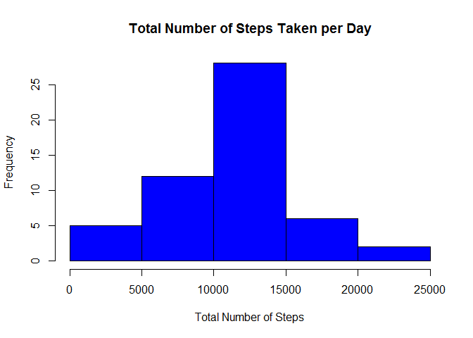
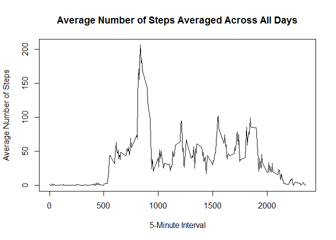
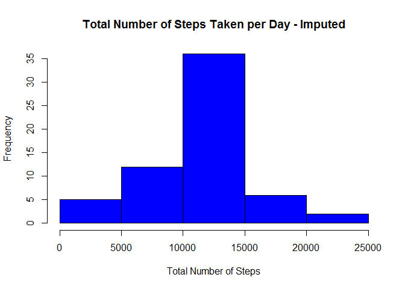
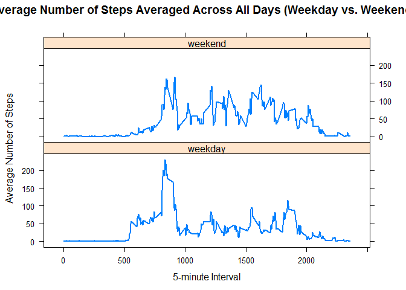

# Reproducible Research: Course Project 1
Daniel Chang  
March 11, 2017  

# Loading and preprocessing the data

Show any code that is needed to

1. Load the data (i.e. read.csv())


```r
setwd("C:/Users/Dan/Desktop/Coursera Data Science/Reproducible Research/Week 2")

## Download data set
URL <-"https://d396qusza40orc.cloudfront.net/repdata%2Fdata%2Factivity.zip"
destfile <- file.path(getwd(),"data.zip")
download.file(URL, destfile)


unzip("./data.zip")
rawcsv <- read.csv("activity.csv")
```
2. Process/transform the data (if necessary) into a format suitable for your analysis


```r
## Convert date factor to date class
rawcsv$date <- as.Date(rawcsv$date, format = "%Y-%m-%d")
```

# What is mean total number of steps taken per day?

For this part of the assignment, you can ignore the missing values in the dataset.

1. Make a histogram of the total number of steps taken each day


```r
## Calculate total number of steps each day and store in totalsteps
totalsteps <- aggregate(steps ~ date, rawcsv, sum, na.rm = TRUE)

## Create a histogram of total number of steps per day
hist(totalsteps$steps, col = "blue", main = "Total Number of Steps Taken per Day", 
     xlab = "Total Number of Steps")
```

<!-- -->

2. Calculate and report the mean and median total number of steps taken per day


```r
##Calculate the mean total number of steps taken per day
mean(totalsteps$steps)
```

```
## [1] 10766.19
```

```r
##Calculate the median total number of steps taken per day
median(totalsteps$steps)
```

```
## [1] 10765
```


# What is the average daily activity pattern?

1. Make a time series plot (i.e. type = "l") of the 5-minute interval (x-axis) and the average number of steps taken, averaged across all days (y-axis)


```r
##Take the average aggregate of steps by the interval and store into avgagg
avgagg<- aggregate(steps ~ interval, rawcsv, mean, na.rm = TRUE)

##Create the time series plot
plot(avgagg$interval, avgagg$steps, type='l', col=1, 
     main="Average Number of Steps Averaged Across All Days", xlab="5-Minute Interval", 
     ylab="Average Number of Steps")
```

<!-- -->

2. Which 5-minute interval, on average across all the days in the dataset, contains the maximum number of steps?


```r
## Determine which row has the maximum number of steps
maxsteps <- which.max(avgagg$steps)

## Use the max steps row value to specify the 5-minute interval 
avgagg[maxsteps, ]
```

```
##     interval    steps
## 104      835 206.1698
```


# Imputing missing values

Note that there are a number of days/intervals where there are missing values (coded as NA). The presence of missing days may introduce bias into some calculations or summaries of the data.

1. Calculate and report the total number of missing values in the dataset (i.e. the total number of rows with NAs)


```r
##Sum the total number of NA values
sum(is.na(rawcsv))
```

```
## [1] 2304
```

2. Devise a strategy for filling in all of the missing values in the dataset. The strategy does not need to be sophisticated. For example, you could use the mean/median for that day, or the mean for that 5-minute interval, etc.


```r
##Replace NA values with the mean of 5-minute interval
impdata <- rawcsv

for (i in 1:nrow(impdata)) {
        if (is.na(impdata$steps[i])) {
                impinterval <- impdata$interval[i]
                intervalmean <- avgagg[avgagg$interval == impinterval,]
                impdata$steps[i] <- intervalmean$steps
        }
}
```

3. Create a new dataset that is equal to the original dataset but with the missing data filled in.


```r
## The average aggregate of steps by the interval in the imputed data set
impavgagg <- aggregate(steps ~ date, impdata, sum)
head(impavgagg)
```

```
##         date    steps
## 1 2012-10-01 10766.19
## 2 2012-10-02   126.00
## 3 2012-10-03 11352.00
## 4 2012-10-04 12116.00
## 5 2012-10-05 13294.00
## 6 2012-10-06 15420.00
```

```r
## This value should be 0 if all NA values were properly replaced
sum(is.na(impavgagg))
```

```
## [1] 0
```

4. Make a histogram of the total number of steps taken each day and Calculate and report the mean and median total number of steps taken per day. Do these values differ from the estimates from the first part of the assignment? What is the impact of imputing missing data on the estimates of the total daily number of steps?


```r
## Histogram of the imputed data set
hist(impavgagg$steps, col = "blue", 
     main = "Total Number of Steps Taken per Day - Imputed", 
     xlab = "Total Number of Steps")
```

<!-- -->

```r
## Mean total number of steps taken per day in the imputed data set
mean(impavgagg$steps)
```

```
## [1] 10766.19
```

```r
## Median number of steps taken per day in the imputed data set
median(impavgagg$steps)
```

```
## [1] 10766.19
```


The mean and median total number of steps taken per day for the imputed data set
are both 10766.19. In the original data set with the NA values removed, the mean was 
10766.19 and the median was 10765. Imputing the missing values with the mean 5-minute interval has caused a change in the median total number of steps taken per day.


# Are there differences in activity patterns between weekdays and weekends?

For this part the weekdays() function may be of some help here. Use the dataset with the filled-in missing values for this part.

1. Create a new factor variable in the dataset with two levels -- "weekday" and "weekend" indicating whether a given date is a weekday or weekend day.


```r
## Create a new column to indicate day of the week
impdata$day <- weekdays(impdata$date)

## Create a new column to indicate weekday vs weekend
impdata$daytype <- NA

## Assign impdata$daytype as weekday
impdata[!(impdata$day == "Saturday" | impdata$day == "Sunday"), ]$daytype <- "weekday"

## Assign impdata$daytype as weekend
impdata[impdata$day == "Saturday" | impdata$day == "Sunday", ]$daytype <- "weekend"

## Assign impdata$daytype as a factor
impdata$daytype <- factor(impdata$daytype)
```

2. Make a panel plot containing a time series plot (i.e. type = "l") of the 5-minute interval (x-axis) and the average number of steps taken, averaged across all weekday days or weekend days (y-axis). The plot should look something like the following, which was created using simulated data:


```r
## The average aggregate of steps by the interval in the imputed data set sorted by weekend vs. weekday
impavgaggweek <- aggregate(steps ~ interval + daytype, impdata, mean)

## Create a panel plot
library(lattice)

xyplot(steps ~ interval | daytype, impavgaggweek, type = "l", lwd = 2,
       layout = c(1, 2), 
       xlab = "5-minute Interval", 
       ylab = "Average Number of Steps",
       main = "Average Number of Steps Averaged Across All Days (Weekday vs. Weekend)"
       )
```

<!-- -->
